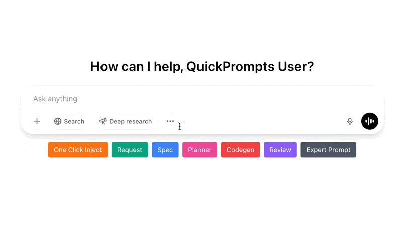
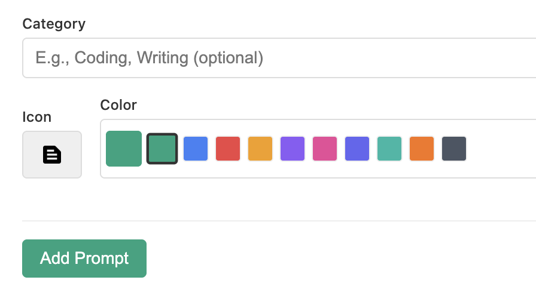
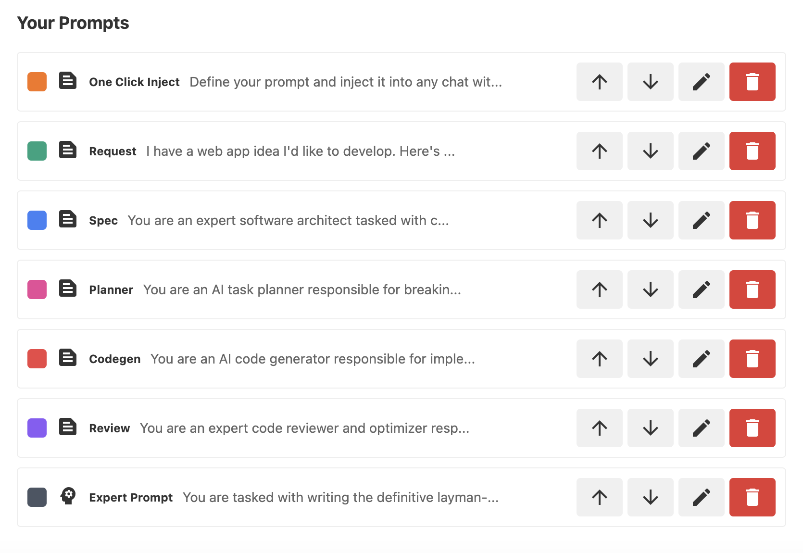
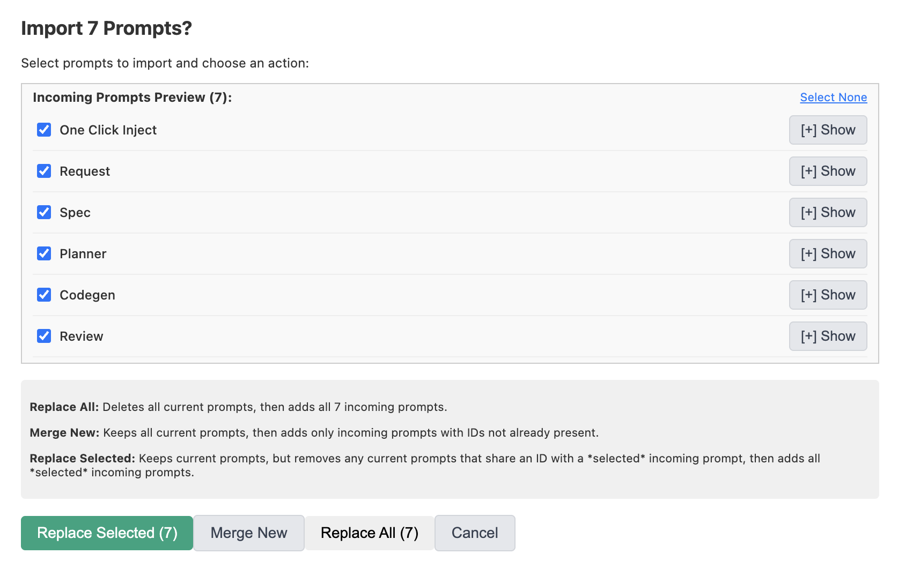
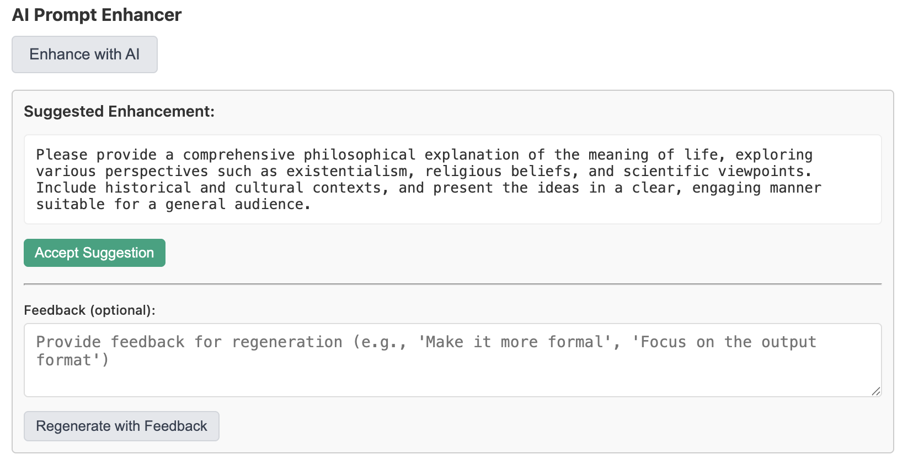

# QuickPrompts

A Chrome extension that allows you to quickly inject pre-defined prompt templates into conversations without copy-pasting.



## Features

- ✨ Quickly insert saved prompts with a single click
- 📝 Create, edit, and manage a library of frequently used prompts
- 🎨 Customize prompts with colors and icons for easy identification
- 🔍 Organize prompts with categories
- 🤖 Optional AI-based categorization using your OpenAI API key
- ✨ AI-powered Prompt Enhancer to refine your prompts before saving (requires OpenAI API key)
- 📱 Works with **ChatGPT, Gemini, Grok, Microsoft Copilot, Perplexity AI, DeepSeek, T3 Chat, Claude, Mistral, and Google AI Studio**
- 📦 Stores prompts locally on your device
- 🔄 Preserves all formatting and line breaks in your prompts
- 🖱️ Inserts text at cursor position or replaces selected text
- 📥 Import/Export prompts as JSON
- 🪄 Enhanced Import options: Merge new prompts, replace existing prompts by ID, or replace all prompts.

## Installation

### From Chrome Web Store (Coming Soon)

1. Visit the [Chrome Web Store listing](#) (link to be added)
2. Click "Add to Chrome"
3. Confirm the installation

### Manual Installation

1. Download or clone this repository.
2. Run `npm install` to install dependencies.
3. Run `npm run build` to build the extension.
4. Open Chrome and navigate to `chrome://extensions/`.
5. Enable "Developer mode" in the top-right corner.
6. Click "Load unpacked" and select the `dist` folder from this project.

## Usage

### Adding Prompts

1. Click the extension icon in your Chrome toolbar (or right-click -> Options).
2. Enter your prompt text, name, and select a color/icon.
3. Click "Add Prompt".





### Using Prompts

1. Visit a supported platform:
   - **ChatGPT** (`chat.openai.com`, `chatgpt.com`)
   - **Gemini** (`gemini.google.com`)
   - **Grok** (`grok.com`, `x.com/i/grok`)
   - **Microsoft Copilot** (`copilot.microsoft.com`)
   - **Perplexity AI** (`perplexity.ai`)
   - **DeepSeek** (`chat.deepseek.com`)
   - **T3 Chat** (`t3.chat`)
   - **Claude** (`claude.ai`)
   - **Mistral AI** (`chat.mistral.ai`)
   - **Google AI Studio** (`aistudio.google.com`)
2. Look for the QuickPrompts buttons injected near the input area.
3. Click any prompt to insert it at your cursor position.
4. Edit the inserted text as needed before sending.

### Import/Export Prompts

1. Go to the extension options page (right-click extension icon -> Options).
2. In the "Prompts" tab, find the "Import Prompts" and "Export Prompts" buttons.
3. **Export:** Click "Export Prompts" to save your current prompts to a JSON file.
4. **Import:** Click "Import Prompts", select your JSON file. A preview modal will appear:
    - **Preview & Select:** Review incoming prompts, expand to see full text, and select specific prompts using the checkboxes.
    - **Select All/None:** Quickly toggle the selection of all incoming prompts.
    - **Choose Action:**
        - `Replace Selected`: Replaces existing prompts that have the same ID as the *selected* incoming prompts.
        - `Merge New`: Adds only incoming prompts with IDs not already present.
        - `Replace All`: Deletes all current prompts and adds all incoming prompts.
        - `Cancel`: Close the modal without importing.



### AI Categorization (Optional)

1. Go to the extension options and click the "Settings" tab.
2. Enter your OpenAI API key.
3. Go to the "AI Categorization" tab.
4. Let the AI suggest categories for your prompts.
5. Accept or reject the suggestions.

### AI Prompt Enhancer (Optional)

1.  Go to the extension options page (right-click extension icon -> Options).
2.  Navigate to the "Settings" tab.
3.  Enter your OpenAI API Key and save settings. Compatible AI models will load.
4.  Select your preferred AI model from the dropdown and save settings again.
5.  Navigate to the "Prompts" tab.
6.  When adding a **new** prompt, after typing your initial text, click the "Enhance with AI" button.
7.  Review the AI's suggestion.
8.  You can "Accept Suggestion" to replace your text, or provide feedback and click "Regenerate with Feedback" for another suggestion.



### Settings

- **OpenAI API Key:** Required for AI Categorization and Prompt Enhancer features.
- **AI Model for Enhancement:** Choose the model used by the Prompt Enhancer.
- **Enable Debug Mode:** Show detailed logs in the browser console for troubleshooting.
- **Show Icons on Buttons:** Toggle visibility of icons next to prompt names on injected buttons.

## Development

This extension is built with:
- TypeScript
- React (for the options page)
- Chrome Extension APIs
- Webpack for building

### Project Structure

- `/src/content-scripts`: Content script injected into supported sites.
- `/src/options`: React components for the options page.
- `/src/utils`: Shared utilities (storage, API calls).
- `/src/background`: Background script (service worker).
- `/dist`: Built extension files.
- `/public`: Static assets (icons, manifest, options HTML).

### Building

```bash
# Install dependencies
npm install

# Build the extension (creates the /dist folder)
npm run build

# For development with auto-rebuild on changes
npm run watch
```

## Recent Changes

- Added support for Microsoft Copilot.
- Added support for Perplexity AI.
- Fixed settings persistence issue (model, icon toggle).
- Fixed feedback textarea overflow in prompt enhancer.
- Added "Select All / None" toggle to import modal.
- Reordered buttons in import modal for better UX.
- Fixed icon visibility toggle not updating injected buttons immediately.

## Contributing

Contributions are welcome! Please feel free to submit a Pull Request.

## License

This project is licensed under the MIT License - see the [LICENSE](LICENSE) file for details.

## Acknowledgments

- Icons from Material Design Icons.
