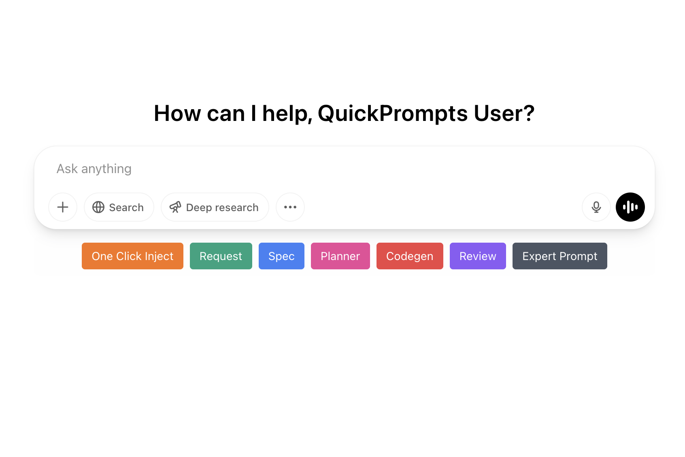

# ChatGPT Quick Prompts

A Chrome extension that allows you to quickly inject pre-defined prompt templates into ChatGPT conversations without copy-pasting.



## Features

- ✨ Quickly insert saved prompts with a single click
- 📝 Create, edit, and manage a library of frequently used prompts
- 🎨 Customize prompts with colors and icons for easy identification
- 🔍 Organize prompts with categories
- 🤖 Optional AI-based categorization using your OpenAI API key
- 📱 Works with both chat.openai.com and chatgpt.com domains
- 📦 Stores prompts locally on your device (with optional sync)
- 🔄 Preserves all formatting and line breaks in your prompts
- 🖱️ Inserts text at cursor position or replaces selected text

## Installation

### From Chrome Web Store (Coming Soon)

1. Visit the [Chrome Web Store listing](#) (link to be added)
2. Click "Add to Chrome"
3. Confirm the installation

### Manual Installation

1. Download or clone this repository
2. Run `npm install` to install dependencies
3. Run `npm run build` to build the extension
4. Open Chrome and navigate to `chrome://extensions/`
5. Enable "Developer mode" in the top-right corner
6. Click "Load unpacked" and select the `dist` folder from this project

## Usage

### Adding Prompts

1. Click the extension icon in your Chrome toolbar
2. Enter your prompt text, name, and select a color/icon
3. Click "Add Prompt"

### Using Prompts

1. Visit ChatGPT (chat.openai.com or chatgpt.com)
2. Look for the prompt buttons below the input area
3. Click any prompt to insert it at your cursor position
4. Edit the inserted text as needed before sending

### AI Categorization (Optional)

1. Go to the extension options and click the "Settings" tab
2. Enter your OpenAI API key
3. Go to the "AI Categorization" tab
4. Let the AI suggest categories for your prompts
5. Accept or reject the suggestions

## Development

This extension is built with:
- TypeScript
- React (for the options page)
- Chrome Extension APIs
- Webpack for building

### Project Structure

- `/src/content-scripts`: Content script injected into ChatGPT
- `/src/options`: React components for the options page
- `/src/utils`: Shared utilities
- `/src/background`: Background script

### Building

```bash
# Install dependencies
npm install

# Build the extension
npm run build
```

## Contributing

Contributions are welcome! Please feel free to submit a Pull Request.

## License

This project is licensed under the MIT License - see the [LICENSE](LICENSE) file for details.

## Acknowledgments

- Icons from Material Design Icons
- Special thanks to OpenAI for ChatGPT 